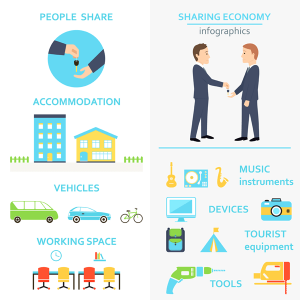

# Keep It Moving (ATX)
## an open source ride sharing solution that plans and tracks multi-modal trips.

===

#Meet KIM ATX

##Empowering you to create a commumunity around seamless commuting.

===

##KIM will know the
- current traffic activity with past and future forecast
- help schedule and coordinate them for you in the best mode for you
- such as metro, rail, car-pool, rideshare, bike, walk

===

# Austin Traffic

===

# We can do better, we will together.

===

# How?
## Get users and the info they feed our open source mobility.community engine

===

# So what is the difference?

===

##This app gives gives more control over transportation options
1. Helps track your miles traveled/saved.
2. Helps build a focused community of commuters.
3. Makes it easier to plan a trip.
4. Database allows for other mobility options like community walk/bike-athons.

<->

#But what is really COOL about it?
1. User-fed data makes the app smarter for you and entire community.
2. Carbon and Ozone offset reports by community and individual
3. Tracks savings.
4. Helps gamify your info so that you can encourage your circle of friends to also compete for rewards.

===

<->

# Powered by a scalable open source engine available to anyone anywhere, increasing competition and innovation.

<->

## What is the impact for Mobility Week?
1. Full report of activity for each individual and a city as a whole
2. Companies can sign on board easily with little to no training.
2. Convert miles saved to carbon and ozone offset
3. Helps create better community mobility habits
4. Open source democratizes the market, disrupts the industry, and allows for new entrants.

===

What in it for the city?
# How it all works together
1. Open data makes intelligent commuting decisions.
2. Data to be shared with other cities.
3. Study traffic patterns and build better routes across neighborhoods, cities and as a whole.
4. This solution can be implemented in other cities
5. Helps Austin become the leader in community ride-sharing.

===

Note: 6. Improve the local air quality.
7. Increase productivity.
8. Save money on individual transportation costs.

===

#Future versions of this app may include:
1. Usability across all platforms.
2. Data sharing that helps municipalities plan road maintenance and transportation system efficiencies.
3. Discussion platforms that enriches user engagement protocols.
4. Push based notifications for relevant route alerts.
5. Integrations for event planners to manage transportation needs of their attendees.
